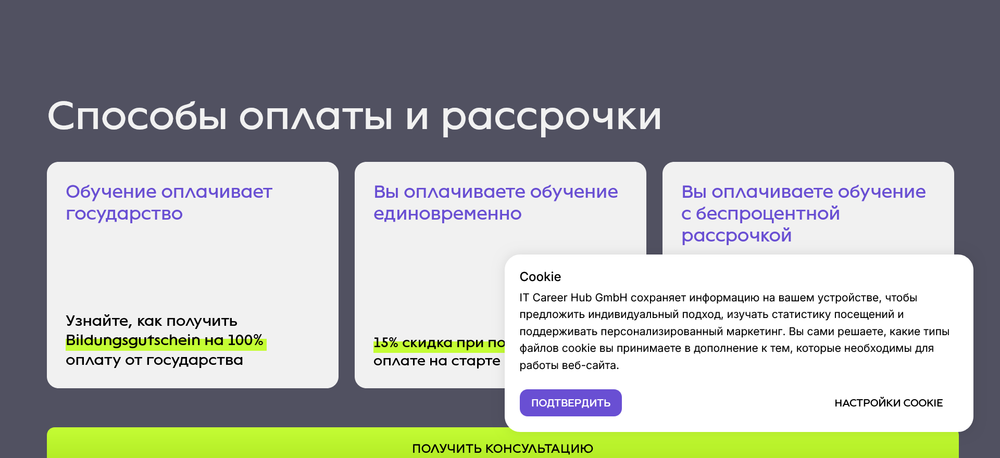

# Selenium: Payment-Methods Screenshot Automation

End-to-end browser automation with **Selenium WebDriver (Firefox / geckodriver)**:
opens the site, navigates to the payment-methods section and captures a screenshot.



## Files
- `payment_screenshot.py` — automation script
- `payment_methods_section.png` — captured result
- `requirements.txt` — dependencies

## Run
```bash
pip install -r requirements.txt
python payment_screenshot.py
```
Requires Firefox + [geckodriver](https://github.com/mozilla/geckodriver/releases) in `PATH`.
